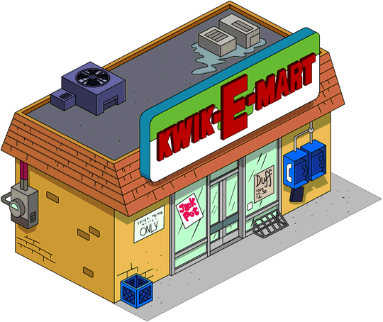
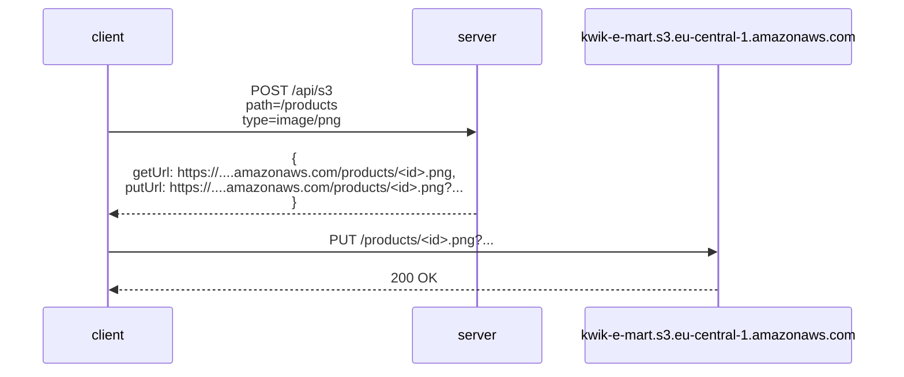
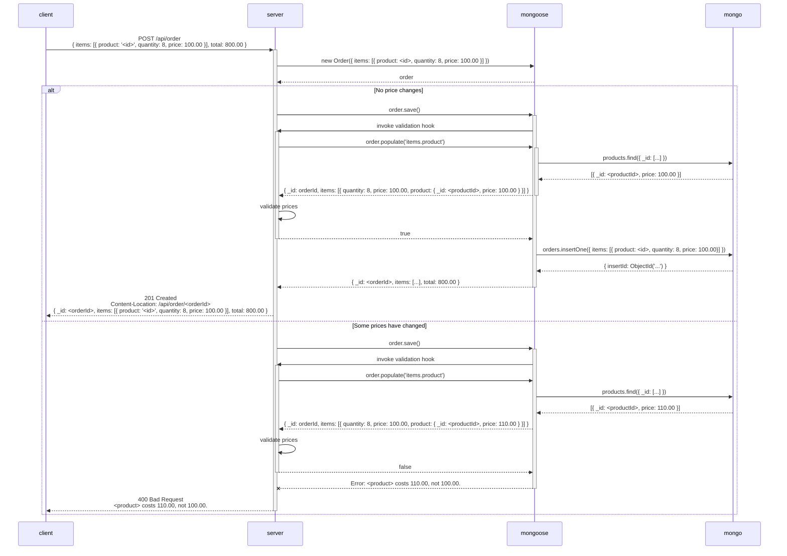

### Deployment

#### Live Version

https://roninbar.herokuapp.com/

###### Test User Credentials

| Role     | Username                 | Password   |
| -------- | ------------------------ | ---------- |
| customer | customer@kwik-e-mart.com | `customer` |
| admin    | admin@kwik-e-mart.com    | `admin`    |

#### Deploy Your Own

### Environment Variables

| Name                    | Description                                   | Default Value                     |
| ----------------------- | --------------------------------------------- | --------------------------------- |
| `AWS_REGION`            | AWS region.                                   | `eu-central-1`                    |
| `AWS_S3_BUCKET`         | AWS S3 bucket name.                           | `kwik-e-mart`                     |
| `AWS_ACCESS_KEY_ID`     | AWS IAM access key ID.                        |                                   |
| `AWS_SECRET_ACCESS_KEY` | AWS IAM access secret key.                    |                                   |
| `DEBUG`                 | Filter for `debug` messages.                  | `server:*`                        |
| `MONGODBURL`            | URL of the Mongo database.                    | `mongodb://localhost/kwik-e-mart` |
| `PORT`                  | TCP port for incoming HTTP requests.          | `3000`                            |
| `SECRET_FOR_SESSION`    | A secret encryption key for session cookies.  |                                   |
| `SECRET_FOR_USER`       | A secret encryption key for user credentials. |                                   |
| `SIDNAME`               | The name of the session cookie.               | `connect.sid`                     |

### API Endpoints

| Method   | URL                                            | Request Payload                                                       | Response                                                                                                            | Semantics                                             | Required Privilege                  | Comments                                                                                     |
| -------- | ---------------------------------------------- | --------------------------------------------------------------------- | ------------------------------------------------------------------------------------------------------------------- | ----------------------------------------------------- | ----------------------------------- | -------------------------------------------------------------------------------------------- |
| `GET`    | `/api/auth`                                    | N/A                                                                   | &bull;&nbsp;200 if successful. &bull;&nbsp;404 if not logged in.                                                    | Get the current user.                                 | N/A                                 | The response shall not include a `Set-Cookie` header.                                        |
| `PUT`    | `/api/auth`                                    | `username`, `password`                                                |                                                                                                                     | Log in.                                               | N/A                                 | The response shall include a `Set-Cookie` header.                                            |
| `DELETE` | `/api/auth`                                    |                                                                       |                                                                                                                     | Log out.                                              | N/A                                 | The response shall include a `Set-Cookie` header to clear the cookie set by `PUT /api/auth`. |
| `PUT`    | `/api/user/:userid`                            | `email`, `password`, `firstName`, `lastName`, `city`, `streetAddress` | Sign up (create a new user account).                                                                                | N/A                                                   | `userId` is user's ID Card # (ת.ז.) |                                                                                              |
| `POST`   | `/api/category`                                | `name`                                                                |                                                                                                                     | Create a new product category.                        | `admin`                             |                                                                                              |
| `GET`    | `/api/category/all`                            |                                                                       |                                                                                                                     | Get all the categories.                               | `user`                              | The response shall not include the products arrays.                                          |
| `GET`    | `/api/category/:categoryId`                    |                                                                       |                                                                                                                     | Get details for the specified category.               | `user`                              | The response shall not include the products array.                                           |
| `POST`   | `/api/category/:categoryId/product`            | `name`, `price`, `imageUrl`                                           |                                                                                                                     | Create a new product in the specified category.       | `admin`                             |                                                                                              |
| `GET`    | `/api/category/:categoryId/product/all`        |                                                                       |                                                                                                                     | Get all the products in the specified category.       | `user`                              |                                                                                              |
| `GET`    | `/api/category/:categoryId/product/:productId` |                                                                       |                                                                                                                     | Get details for the specified product.                | `user`                              |                                                                                              |
| `PUT`    | `/api/category/:categoryId/product/:productId` | `name`, `price`, `imageUrl`                                           | &bull; 204 if successful. &bull;&nbsp;404 if the product doesn't exist or doesn't belong to the specified category. | Replace the product's details with the ones enclosed. | `admin`                             |                                                                                              |
| `DELETE` | `/api/category/:categoryId/product/:productId` |                                                                       |                                                                                                                     | Delete the specified product.                         | `admin`                             |                                                                                              |
| `POST`   | `/api/order`                                   |                                                                       |                                                                                                                     | Check out (create a new order).                       | `user`                              |                                                                                              |
| `GET`    | `/api/order/all`                               |                                                                       |                                                                                                                     | Get a detailed list of all the orders.                | N/A                                 |                                                                                              |
| `GET`    | `/api/order/:orderId`                          |                                                                       |                                                                                                                     | Get details for the specified order.                  | N/A                                 |                                                                                              |
| `POST`   | `/api/s3`                                      | `path`, `type`                                                        |                                                                                                                     | Generate a new S3 signed URL for direct upload.       | `admin`                             |                                                                                              |

### Sequence Diagrams

#### Product Image Upload

Install [this Chrome extension](https://chrome.google.com/webstore/detail/mermaid-diagrams/phfcghedmopjadpojhmmaffjmfiakfil) to view the diagram on GitHub.

#### Order Flow

Install [this Chrome extension](https://chrome.google.com/webstore/detail/mermaid-diagrams/phfcghedmopjadpojhmmaffjmfiakfil) to view the diagram on GitHub.

